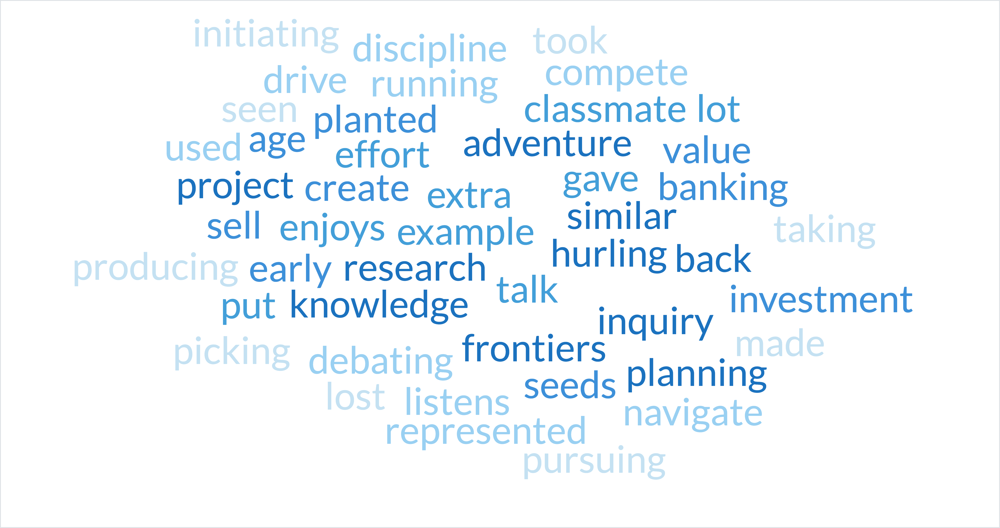
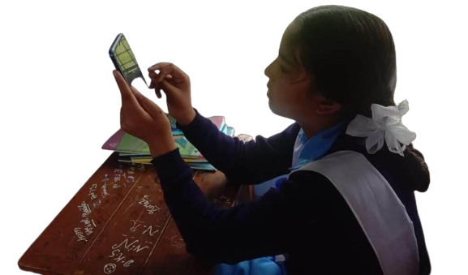

# 🔩 Journey of MARch

**Stage 1 : Research**

**A. Primary Research**

Our search and journey of real world youth actions took us to many different places across urban and rural India. We spoke to people from various walks of life, including farmers, government staff, youth, parents, entrepreneurs and educators. \[[Link to our notes](https://docs.google.com/spreadsheets/d/1lunRFlg6qsjYlBwZQvyAgIEIBRobYzgwNfKJ1X\_LBT0/edit?usp=sharing)]


Our Goal **:** To collect as many examples as possible of specific behavioural traits, that can be observed in a person's normal day-to-day life, which indicate an enterprising mindset and/or high agency.


<figure><figcaption>
Word Cloud: Actions listed by interviewees
</figcaption></figure>

Actions were documented and mapped to Udhyam’s mindsets (grit, trying new things, self-awareness, independent decision-making). A list of common Actions was curated. \[[Link to our notes](https://docs.google.com/spreadsheets/d/1JM\_8aEtzmpnJ1zb08ULYTwYlxuz7iiPJ\_uIk0MNOgvI/edit#gid=1397825801)]

Learn More about our Primary Research

We recognised that for the final Action Tool to be effective, it would have to address the challenges it previously faced in assessing entrepreneurial mindsets from the primary research stage itself. So, committment to a nuanced, inclusive primary research has meant translating it to local languages while also capturing nuances of local usage. For example, it was learned that Kannada speakers used the word “dhairya” or courage for enterprising.&#x20;

To decode the actions that underlined an entrepreneurial mindset, the questionnaire asked adults "Can you share examples of youth you've come across who you felt will do very well in life? And what specific actions of theirs made you feel so?". Similarly, the youth were asked questions like "Can you think of peers (less than 20yrs) you've come across, in your village/context,  who you felt will do very well in life. What specific actions of theirs made you feel so?".

***

**B. Secondary Research**

We conducted in-depth review of literature studying cognitive traits, behavioural manifestations and measurement methods. \[[Link to our notes](https://docs.google.com/spreadsheets/d/1i590SzM7wluOgHrftbDgSAs5oXMKh44DjSsMC-Dt5BM/edit?usp=sharing)]

***

**C. Ecosystem Learning**

We also engaged in knowledge sharing conversations with academics, measurement experts and organisations in the space - Stanford SPARQ, Character Lab, UPenn, IIMB, Life Skills Collaborative, Koach.ai, Toolbox and more. We identified many supporters/mentors. \[[Link to our notes](https://docs.google.com/spreadsheets/d/1lunRFlg6qsjYlBwZQvyAgIEIBRobYzgwNfKJ1X\_LBT0/edit#gid=1314978057)]

***

**STAGE 2 : Testing and Version 1 Tool Development**

**Tool Design & Development**:&#x20;

* Self-Reported: For Version 1, we concluded that a self-reported method would be optimal after research and internal discussions. \[[Link to our notes](https://docs.google.com/spreadsheets/d/1JM\_8aEtzmpnJ1zb08ULYTwYlxuz7iiPJ\_uIk0MNOgvI/edit#gid=2093649971)]

Advantages of the Self-Reported Method

* Operates independently without the need for a facilitator or observer.&#x20;
* Empowers learners to leverage their own knowledge and experiences, both in educational settings and beyond, to determine the most suitable course of action.
* Encourages individuals to inquire about unexplored experiences, allowing us to prompt questions like, "If you haven't traveled on a bus alone, what factors have prevented you from doing so?"

* Shortlisting Actions: From the list of real world actions curated and mapped from our primary and secondary research, we shortlisted 20 actions in line with all four of Udhyam’s Mindsets. Here, we followed [our principles](our-principles.md) to help us shortlist actions.\

* Iteratively designing the tool and translations: We drafted an initial questionnaire, translated it into 4 Indian languages \[Hindi, Telugu, Malayalam and Punjabi] and tested with small groups of learners in Delhi, Punjab, Uttarakhand, Andhra Pradesh, and Kerala - 10-25 as FGDs and one-on-one interviews. Based on learnings we improved the original English statements and numerous local language words on the tool.

**This helped us develop Version 1 of the Actions Tool.**

<figure><figcaption>
Student in Uttarakhand filling the Actions Tool on mobile devices provided
</figcaption></figure>
